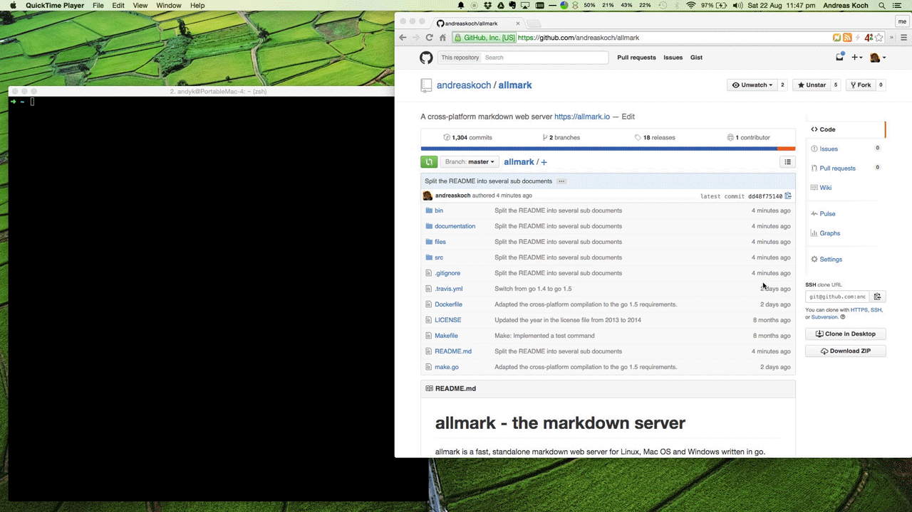
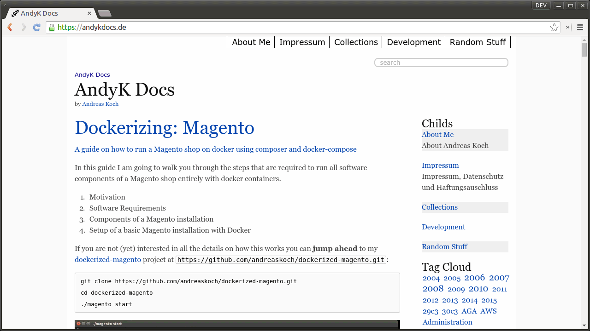

# allmark - the markdown server

allmark is a fast, standalone markdown web server for Linux, Mac OS and Windows written in go.


allmark is a file-system-centric markdown web server. You can **point it at any directory that contains markdown files** and it will immediately start a web-server that serves the rendered HTML content of the markdown file to you.

And it will not only render the markdown files in your directory as HTML, but it will also add everything that it needed for a complete website: Navigation, Full-text Search, Theming, Sitemap, RSS, Tags, ... on-the-fly with websocket-based live-reload.

[](files/animation-clone-installation-and-test.gif)

And thanks to the power of [go](http://golang.org/) all of this is super fast and done with a single standalone application.

## Usage

Serve a specific directory:

```bash
allmark serve <directory path>
```

Serve the current directory:

```bash
cd markdown-repository
allmark serve
```

Serve the current directory with **live-reload** enabled:

```bash
allmark serve -livereload
```

Force a full **reindex** every 60* seconds:

```bash
allmark serve -reindex
```

`*` When enabled the default interval is 60 seconds. You can change the interval in the repository config.

Force HTTPS (redirect all http requests to HTTPS):

```bash
allmark serve -secure
```

Save the default configuration to the `.allmark` folder so you can customize it:

```bash
allmark init
```

You can point **allmark** at any folder structure that contains **markdown documents** and files referenced by these documents (e.g. this repository folder) and allmark will start a **web-server** and serve the folder contents as HTML via HTTP(s) on a random free port.

**Folder Structure Conventions**

The standard folder structure for a **markdown-repository item** could look something like this:

```
├── files
│   ├── image.png
│   └── more-files
│       ├── file1.txt
│       ├── file2.txt
│       └── file3.txt
└── some-file.md
```

1. one markdown file per folder (with the extension .md, .markdown or .mdown)
2. a `files` folder which contains all files referenced by the markdown document
3. an arbitrary number of child directories that can contain more markdown-repository items

**Nesting / Hierarchie**

You can nest repository items arbitrarily. Example:

```
├── child-item-1
│   └── item1.md
├── child-item-2
│   └── item2.md
├── child-item-3
│   └── item3.md
├── files
│   ├── image.png
│   └── more-files
│       ├── file1.txt
│       ├── file2.txt
│       └── file3.txt
└── some-file.md
```

**Folders without Markdown Files**

- If you have folders in your repository that don't contains markdown files allmark will display and index of all files in that directory (→ **file-collection item**)
- file-collection items cannot have other childs

**Markdown Document Structure**

allmark makes certain assumptions about the structure of your documents. They should have

1. Title
2. Description Text
3. Document Body

A **typical document** expected by allmark could look like this:

```markdown
# Document Title / Headline

A short description of the document ... Usually one sentence.

The Content of your document


- A List 1
- A List 2
- A List 3

**Some garbage text**: In pharetra ullamcorper egestas.
Nam vel sodales velit. Nulla elementum dapibus sem nec scelerisque.
In hac habitasse platea dictumst. Nulla vestibulum lacinia tincidunt.
```

## Download / Installation

You can download the **latest binaries** of allmark for your operating system from [allmark.io/bin](HTTPS://allmark.io/bin)

**Linux (amd64)**

```bash
sudo curl https://allmark.io/bin/linux/amd64/allmark -o /usr/local/bin/allmark
chmod +x /usr/local/bin/allmark
```

**Linux (arm)**

```bash
sudo curl https://allmark.io/bin/linux/arm/allmark -o /usr/local/bin/allmark
chmod +x /usr/local/bin/allmark
```

**Mac OS**

```bash
sudo curl "HTTPS://allmark.io/bin/darwin_amd64/allmark" -o "/usr/local/bin/allmark"
sudo chmod +x /usr/local/bin/allmark
```

**Windows**

```powershell
Invoke-WebRequest HTTPS://allmark.io/bin/windows_amd64/allmark.exe -OutFile allmark.exe
```

All binaries at [allmark.io](HTTPS://allmark.io) are up-to-date builds of the **master**-branch.

If you want to download and install binaries from the **develop**-branch you can go to [develop.allmark.io/bin](HTTPS://develop.allmark.io).

## Features

allmark can convert about any folder structure that contains markdown documents into well-structured websites with

- navigation
- sitemap
- search
- livereload

and serves them via HTTP and/or HTTPs.

For a detailed list of all features goto [documentation/features](documentation/features).

## Demo / Showcase

If you want to see **allmark in action** you can visit my blog [AndyK Docs](https://andykdocs.de/) at [https://andykdocs.de](https://andykdocs.de):



## Build

[](HTTPS://travis-ci.org/andreaskoch/allmark)

There is also an automated docker build at [registry.hub.docker.com/u/andreaskoch/allmark/](HTTPS://registry.hub.docker.com/u/andreaskoch/allmark/) which builds the develop and master branch every time a commit is pushed.

Or you can build allmark yourself if you have [go installed](http://golang.org/doc/install) (see: [documentation/development/build](documentation/development/build)).

## Known Bugs

`-- There are currently no known bugs :dancers: --`

If you encouter a bug please file an issue on at [github.com/andreaskoch/allmark/issues](https://github.com/andreaskoch/allmark/issues).

## Roadmap / To Dos

Here are some of the ideas and todos I would like to add in the future.

### Architecture & Features

- Allow localization/internationalization
- Web editor for markdown documents for collaborative editing
- Additional Data Sources
    - Amazon S3
    - Dropbox support
    - SMTP message posting
    - Repository Replication?
- allmark swarm
    - Repository sharding
    - load-balancing
    - distributed filesystem ([ipfs](http://ipfs.io/))
- Static website generation
- User Management
    - User management pages
- Support for folders with multiple markdown files
- Support for custom-rewrites
- Daemon mode
- Create `install` actions for Windows, Linux and Mac OS which handle the OS integration

### Documentation

- More documentation for public methods ([godoc](http://blog.golang.org/godoc-documenting-go-code))
- More unit-tests
- Integration tests

### Theming

- Redesign default theme
- Create more default themes
- Create a theme "loader"
- Infinite Scrolling for latest items
- Improved Image Galleries

## Contributions

If you want to improve allmark in any way please create a pull request or contact me.
All contributions are welcome!

## Contact

Twitter: [@allmark_io](https://twitter.com/allmark_io) or [@andreaskoch](https://twitter.com/andreaskoch)
Github: [github.com/andreaskoch/allmark](https://github.com/andreaskoch/allmark)
E-Mail: andy@allmark.io
