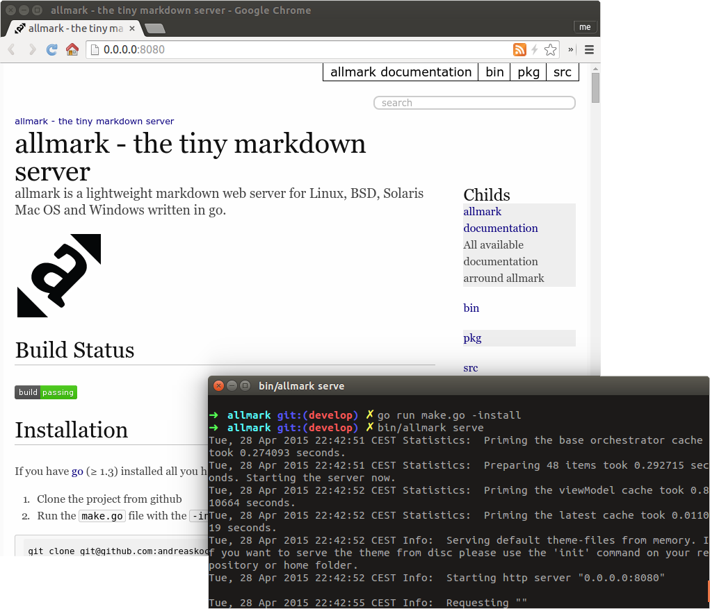

# Building allmark

You can build allmark yourself if you have go or Docker installed

If you have [go](https://golang.org/dl/) installed you can build allmark yourself in two steps:

1. Clone the project from github
2. Run `make`

```bash
git clone git@github.com:andreaskoch/allmark.git
cd allmark
make
```

Afterwards you will find the `allmark` binary in the bin-folder of the project. To test your installation you can start by serving the allmark-project directory:

```bash
bin/allmark serve
```

After a second or so a browser window should pop up.



## Cross-Compilation

You can compile allmark for **macOS**, **Linux** (64bit, ARM5, ARM6, ARM7) and **Windows** (64bit) using the `crosscompile` action of the make script:

```bash
make crosscompile
```

The output will be available in the `bin` folder of this project:

```
bin/
├── allmark_darwin_amd64
├── allmark_linux_amd64
├── allmark_linux_arm_5
├── allmark_linux_arm_6
├── allmark_linux_arm_7
└── allmark_windows_amd64

```

---

created at: 2015-08-05
modified at: 2016-12-13
author: Andreas Koch
tags: Documentation, Build
alias: build, compile
